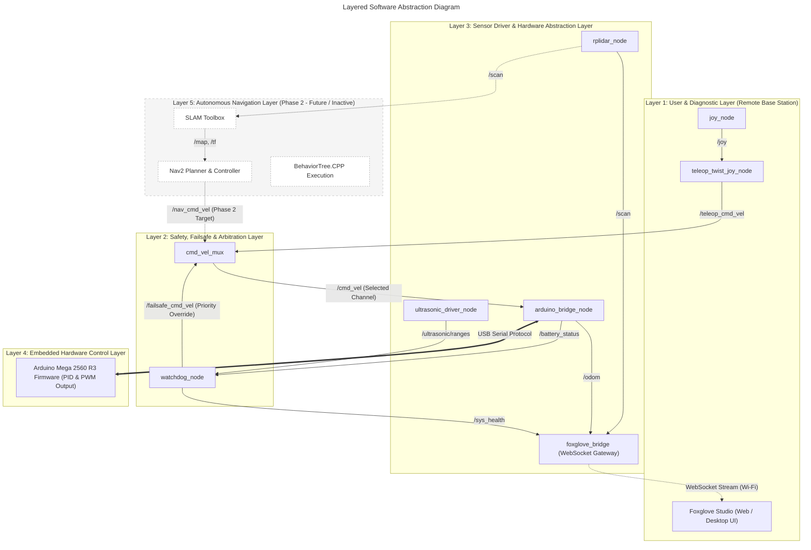

Vscode and github fails to render mermiad graph properly. Use https://mermaid.live/edit

```mermaid
---
title: Layered Software Abstraction Diagram
---

flowchart TD
    subgraph Layer1 ["Layer 1: User & Diagnostic Layer (Remote Base Station)"]
        joy_node["joy_node"]
        teleop_node["teleop_twist_joy_node"]
        foxglove_studio["Foxglove Studio (Web / Desktop UI)"]
    end

    subgraph Layer2 ["Layer 2: Safety, Failsafe & Arbitration Layer"]
        watchdog_node["watchdog_node"]
        cmd_vel_mux["cmd_vel_mux"]
    end

    subgraph Layer3 ["Layer 3: Sensor Driver & Hardware Abstraction Layer"]
        rplidar_node["rplidar_node"]
        ultrasonic_node["ultrasonic_driver_node"]
        arduino_bridge["arduino_bridge_node"]
        foxglove_bridge["foxglove_bridge (WebSocket Gateway)"]
    end

    subgraph Layer4 ["Layer 4: Embedded Hardware Control Layer"]
        embedded_control["Arduino Mega 2560 R3 Firmware (PID & PWM Output)"]
    end
    
    subgraph Layer5 ["Layer 5: Autonomous Navigation Layer (Phase 2 - Future / Inactive)"]
        slam_toolbox["SLAM Toolbox"]
        nav2_stack["Nav2 Planner & Controller"]
        behavior_tree["BehaviorTree.CPP Execution"]
    end

    %% Teleoperation Flow (Phase 1)
    joy_node -->|"/joy"| teleop_node
    teleop_node -->|"/teleop_cmd_vel"| cmd_vel_mux

    %% Future Phase 2 Flow (Dashed)
    nav2_stack -.->|"/nav_cmd_vel (Phase 2 Target)"| cmd_vel_mux
    slam_toolbox -.->|"/map, /tf"| nav2_stack

    %% Watchdog Priority Override
    watchdog_node -->|"/failsafe_cmd_vel (Priority Override)"| cmd_vel_mux
    watchdog_node -->|"/sys_health"| foxglove_bridge

    %% Arbitrated Output to Hardware Layer
    cmd_vel_mux -->|"/cmd_vel (Selected Channel)"| arduino_bridge

    %% Perception & State Feedback Streams to Telemetry Gateway
    rplidar_node -->|"/scan"| foxglove_bridge
    rplidar_node -..->|"/scan"| slam_toolbox
    arduino_bridge -->|"/odom"| foxglove_bridge
    arduino_bridge -->|"/battery_status"| watchdog_node
    ultrasonic_node -->|"/ultrasonic/ranges"| watchdog_node

    %% Telemetry Gateway Stream over Wi-Fi
    foxglove_bridge -.->|"WebSocket Stream (Wi-Fi)"| foxglove_studio

    %% Embedded Bridge Boundary
    arduino_bridge <==>|"USB Serial Protocol"| embedded_control

    %% Styling for Inactive Phase 5 Layer
    style Layer5 fill:#f5f5f5,stroke:#bdbdbd,stroke-dasharray: 5 5;
    style slam_toolbox fill:#ffffff,stroke:#9e9e9e,stroke-dasharray: 3 3;
    style nav2_stack fill:#ffffff,stroke:#9e9e9e,stroke-dasharray: 3 3;
    style behavior_tree fill:#ffffff,stroke:#9e9e9e,stroke-dasharray: 3 3;
```